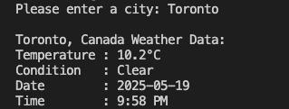

# weather-checker

I made a simple Python script using **WeatherAPI** that outputs the weather conditions of a particular city.  
The user enters their city name of choice and must also enter their **WeatherAPI key** in the file. 

## Requirements


Install the `requests` Python library:

```bash
pip install requests
```
Run the python file after.

## Preview

Here’s what the output looks like when it runs:


